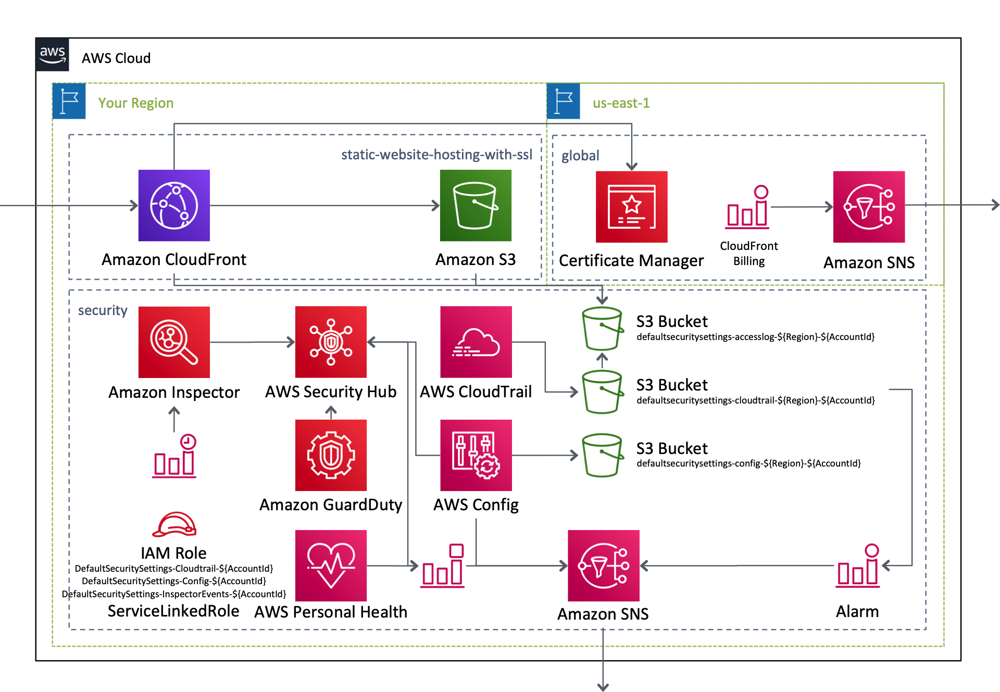

# AWSCloudFormationTemplates

AWSCloudFormationTemplates は、一般的な設定を含む便利なCloudformationテンプレートを提供します。

## テンプレート

本プロジェクトは、以下のCloudformationテンプレートから構成されます。

| テンプレート名 | リージョン | 実行 |
| --- | --- | --- |
| [Security Template](/security/README_JP.md) | ap-northeast-1 |  |
| [Global Settings Template](/global/README_JP.md) | us-east-1 |  |
| [Static Website Hosting Template](/static-website-hosting-with-ssl/README_JP.md) | ap-northeast-1 |   |

## アーキテクチャ

これらのテンプレートが作成するAWSリソースのアーキテクチャ図は、以下の通りです。

