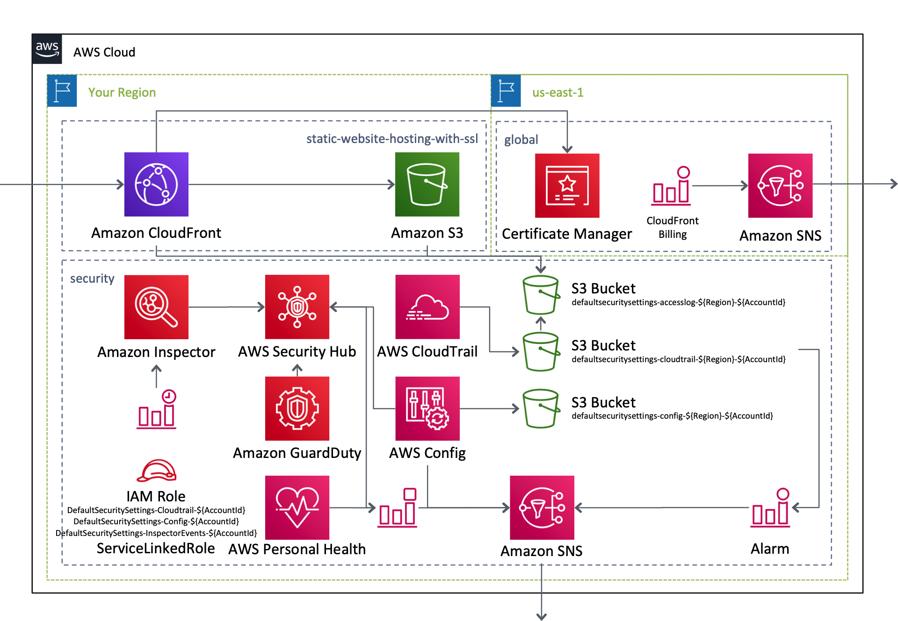

# AWSCloudFormationTemplates/global

AWSCloudFormationTemplates/global creates global settings on N.Virginia Region (`us-east-1`).

## TL;DR

If you just want to deploy the stack follow these steps.

[](https://console.aws.amazon.com/cloudformation/home?region=us-east-1#/stacks/new?stackName=SSLCertificate&templateURL=https://eijikominami.s3-ap-northeast-1.amazonaws.com/aws-cloudformation-templates/global/template.yaml) 

### Deployment

Execute the command to deploy in the ``us-east-1`` region because ``ACM``, ``CloudFront`` and ``Billing`` only support the ``us-east-1`` region.

```bash
aws cloudformation deploy --template-file template.yaml --stack-name GlobalSettings --parameter-overrides DomainName=XXXXX --region us-east-1
```

You can give optional parameters as follows.

| Name | Default | Details | 
| --- | --- | --- |
| ACMValidationMethod | DNS | |
| ACMDomainName | | If it's NOT empty, **SSL certification** is created. |
| BillingAlertThreshold | 0 | If it's NOT ZERO, **CloudWatch Alarm** is created. |
| CloudFrontErrorRateThreshold | 0 | If it's NOT ZERO, **CloudWatch Alarm** is created. |
| CloudFrontBytesDownloadedPerMinuteThreshold | 0 | If it's NOT ZERO, **CloudWatch Alarm** is created. |
| CloudFrontDistributionId | | Targeted CloudFront Distribution Id for monitoring |

## Architecture

The following sections describe the individual components of the architecture.



### AWS Certificate Manager

This template creates a SSL certification in ``AWS Certificate Manager``.

### CloudWatch Alarm

This template creates CloudWatch Alarm about ``Billing`` and ``CloudFront`` (Error Rate, Requests and Download Bytes).

### Other Resources

This template creates some other resources such as ``Amazon SNS``.