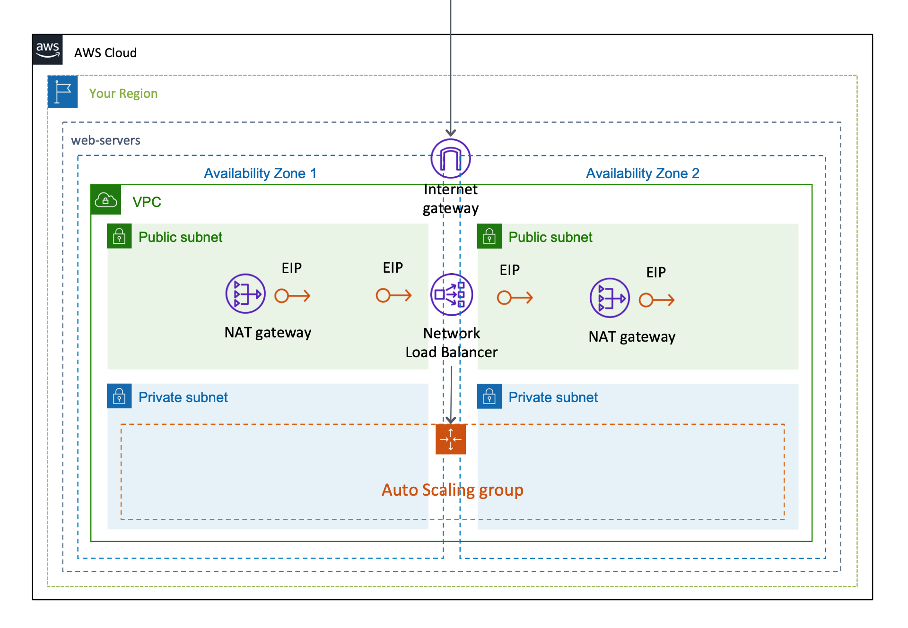

# AWSCloudFormationTemplates/web-servers-with-nlb

AWSCloudFormationTemplates/web-servers-with-nlb builds ``Network Load Balancer``, ``VPC`` and ``EC2`` instances and related resources for **website hosting**.

## TL;DR

If you just want to deploy the stack follow these steps.

[](https://console.aws.amazon.com/cloudformation/home?region=ap-northeast-1#/stacks/new?stackName=WebServersWithNLB&templateURL=https://eijikominami.s3-ap-northeast-1.amazonaws.com/aws-cloudformation-templates/web-servers-with-nlb/template.yaml) 

### Deployment

Execute the command to deploy.

```bash
aws cloudformation deploy --template-file template.yaml --stack-name WebServersWithNLB
```

You can give optional parameters as follows.

| Name | Default | Details | 
| --- | --- | --- |
| AutoScalingDesiredCapacity | 1 | | 
| AutoScalingImageId | ami-068a6cefc24c301d2 | Amazon Linux 2 AMI (HVM), SSD Volume Type (64bit x86) |
| AutoScalingInstanceType | t3.micro | | 
| AutoScalingKeyName | | If it's empty, **SSH key** will NOT be set. |
| AutoScalingMaxSize | 1 | |
| AutoScalingVolumeSize | 8 | |
| AvailabilityZone1 | a | Availability Zone 1 |
| AvailabilityZone2 | c | Availability Zone 2 |
| SubnetPublicCidrBlockForAz1 | 10.0.0.0/24 | Public subnet of AZ1 |
| SubnetExternalCidrBlockForAz1 | 10.0.1.0/24 | Private subnet of AZ1 |
| SubnetPublicCidrBlockForAz2 | 10.0.4.0/24 | Public subnet of AZ2 |
| SubnetExternalCidrBlockForAz2 | 10.0.5.0/24 | Private subnet of AZ2 |
| VPCCidrBlock | 10.0.0.0/21 | |

## Architecture

The following sections describe the individual components of the architecture.

