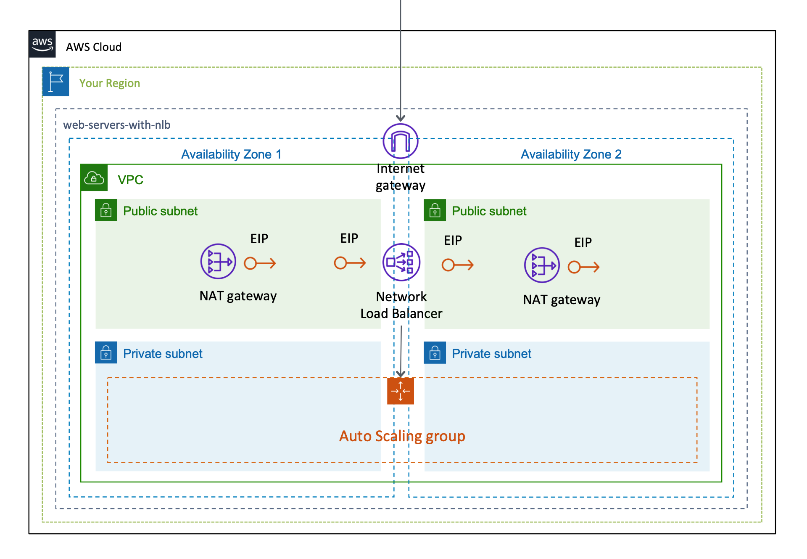

# AWSCloudFormationTemplates/web-servers

AWSCloudFormationTemplates/web-servers は、 ``Network Load Balancer``や ``VPC`` 、 ``EC2`` インスタンスなどの **Webサイトホスティング** に関連するAWSサービスを設定します。

## デプロイ

以下のボタンをクリックすることで、**CloudFormationをデプロイ**することが可能です。

[](https://console.aws.amazon.com/cloudformation/home?region=ap-northeast-1#/stacks/new?stackName=WebServers&templateURL=https://eijikominami.s3-ap-northeast-1.amazonaws.com/aws-cloudformation-templates/web-servers/template.yaml) 

以下のコマンドを実行することで、CloudFormationをデプロイすることも可能です。

```bash
aws cloudformation deploy --template-file template.yaml --stack-name WebServers
```

デプロイ時に、以下のパラメータを指定することができます。

| 名前 | デフォルト値 | 詳細 |
| --- | --- | --- |
| AutoScalingConfig | Enabled | Enabled に設定された場合、AutoScalingGroup と Network Load Balancer が生成されます。 |
| AutoScalingDesiredCapacity | 1 | | 
| AutoScalingMaxSize | 1 | |
| AvailabilityZone1 | a | アベイラビリティゾーン 1 |
| AvailabilityZone2 | c | アベイラビリティゾーン 2 |
| EC2ImageId | ami-068a6cefc24c301d2 | Amazon Linux 2 AMI (HVM), SSD Volume Type (64bit x86) |
| EC2InstanceType | t3.micro | | 
| EC2KeyName | | 値が指定されない場合は、 **SSHキー** は設定されません。 |
| EC2VolumeSize | 8 | |
| SubnetPublicCidrBlockForAz1 | 10.0.0.0/24 | AZ1 の パブリックサブネット |
| SubnetExternalCidrBlockForAz1 | 10.0.1.0/24 | AZ1 の プライベートサブネット |
| SubnetPublicCidrBlockForAz2 | 10.0.4.0/24 | AZ2 の パブリックサブネット |
| SubnetExternalCidrBlockForAz2 | 10.0.5.0/24 | AZ2 の プライベートサブネット |
| VPCCidrBlock | 10.0.0.0/21 | |

## アーキテクチャ

このテンプレートが作成するAWSリソースのアーキテクチャ図は、以下の通りです。

